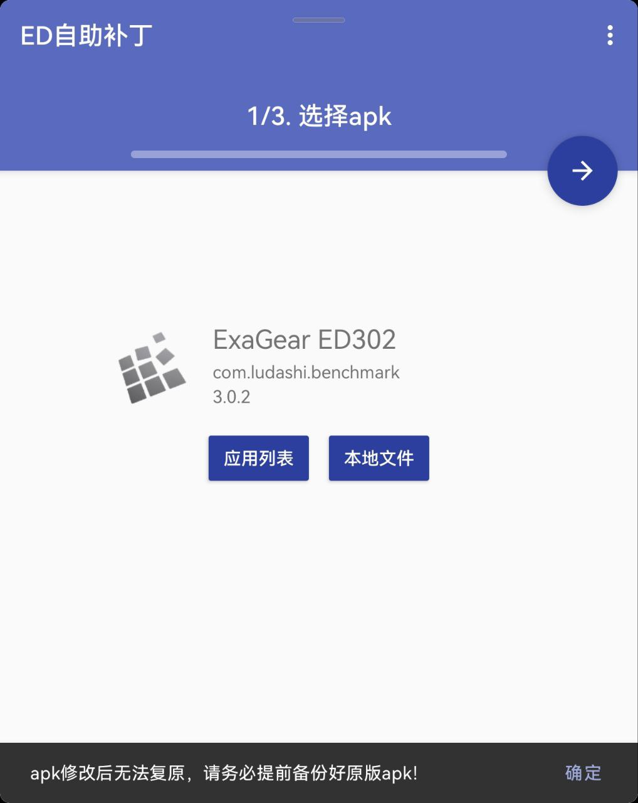
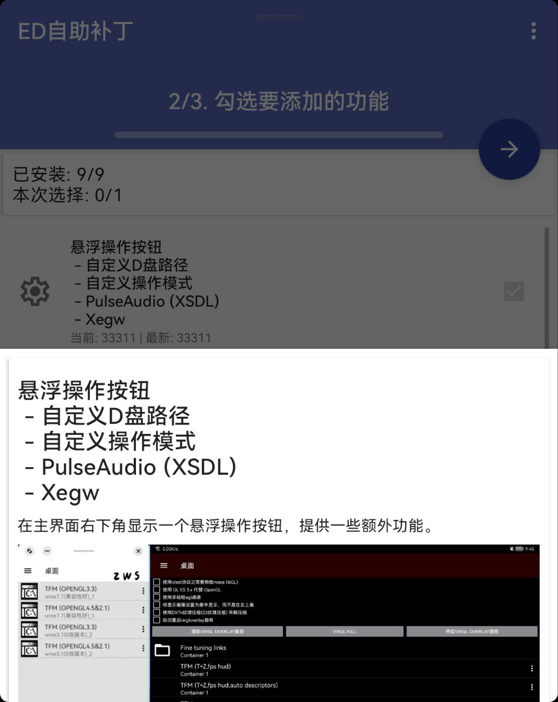
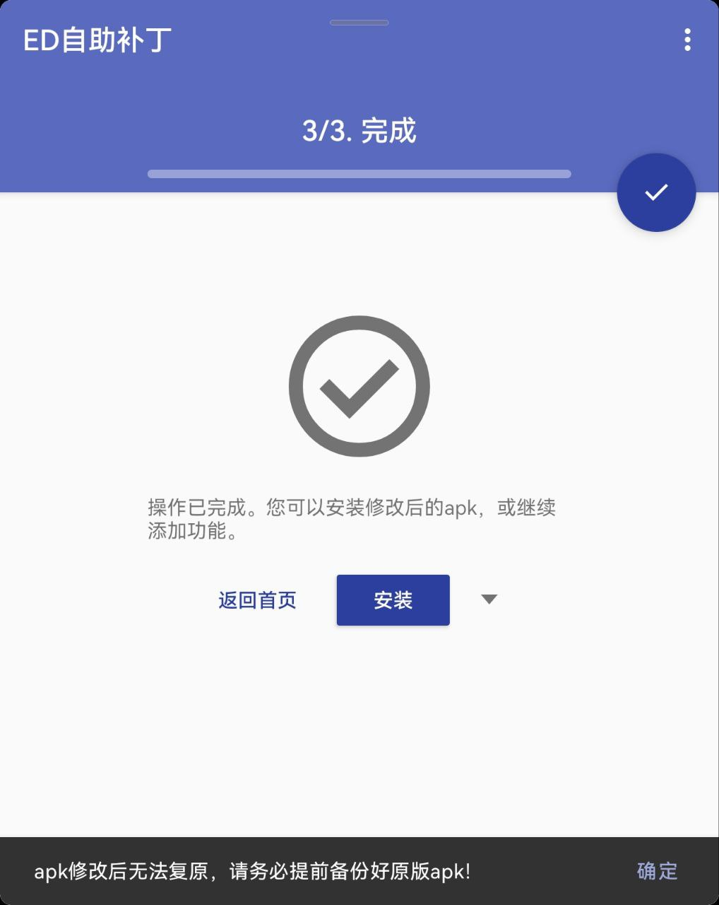

🌐[中文](./readme.md)\
🌐[English](./readme/readme_en.md)\
🌐[Русский](./readme/readme_ru.md)

## 介绍
靠着仅有的一点java基础知识，在为exagear(3.0.2)加了一些小功能之后（主要是通过修改dex实现），我发现手改smali终究还是太麻烦了。
即使提供了修改代码和位置的傻瓜式教程，还是有很多人因为完全不了解apk编辑/dex修改/smali语法而看不懂教程。
所以我在想，能否做一个自动修改apk的应用，用户完全不需要手动编辑smali，只需点一个按钮，等待修改完成后安装新的apk即可。于是本应用便诞生了。
由于能力有限，不保证适用于所有版本，不保证100%修改成功。

- 视频演示：
  - [Youtube](https://youtu.be/t0y_AcWhZxI),
  - [哔哩哔哩](https://www.bilibili.com/video/BV1mY411X7Nn/)
- 下载：
  - [github release](https://github.com/ewt45/EDPatch/releases) 
  - [蓝奏云(更新可能不及时)](https://wwqv.lanzout.com/b012qfz3i) 密码:a63f
## 使用
### 操作步骤
1. 从已安装应用列表，或者本地文件中选择exagear的apk，等待解包完成。
2. 勾选要添加的功能。有关各功能的详细介绍在下面。
3. 点击“开始修改”按钮，耐心等待打包完成。打包进度可以在输出信息中查看。
4. 打包完成后，点击“安装修改后的apk”按钮安装新apk。

### 注意事项
1. 本apk为实验性项目，出现各种bug都是正常现象。
2. 在点击“开始修改”按钮后，请不要点击其他按钮或跳转其他界面，否则可能会出现问题。
3. 打包完成的apk存在于/storage/emulated/0/Android/data/com.ewt45.patchapp/files/patchtmp/tmp/dist/signed/tmp_sign.apk，可以手动在第三方文件管理器中查看。
4. 若在设置中取消勾选“使用默认签名”，打包后需要卸载掉与其签名不同但包名或共享用户ID相同的应用（一般是各种版本的exagear和virgl overlay）才能安装新apk。如果需要保留virgl overlay，请去文件管理器中自己使用同一签名秘钥，手动对二者签名，再安装。

## 目前可添加的功能
- [悬浮操作按钮](https://ewt45.github.io/blogs/2022/winter/exagearFab/) 
  - [自定义d盘路径](https://ewt45.github.io/blogs/2022/winter/exagearFab/driveD.html)
  - [自定义操作模式](https://www.bilibili.com/video/BV1fL41167Ji/)
  - PulseAudio (XSDL)
  - Virgl Overlay (需要原apk已包含旧Virgl Overlay整合)
  - Xegw
- [强制显示鼠标光标](https://ewt45.github.io/blogs/2022/winter/exagearDefaultCursor/)
- [容器设置- 自定义分辨率](https://ewt45.github.io/blogs/2022/autumn/exagearCustomResl/)
- [安卓11+调起输入法](https://ewt45.github.io/blogs/2022/autumn/exagearKeyboard/)
- [手动选择obb](https://ewt45.github.io/blogs/2022/winter/exagearFindObb/)
- [exe快捷方式直接启动](https://www.bilibili.com/video/BV1QM4y1v7RG/)
- [多版本wine共存 v2](https://www.bilibili.com/video/BV1bk4y1K7jR/)
- 容器设置 - 渲染方式
- [容器设置 - 额外启动参数](https://ewt45.github.io/blogs/2023/winter/exagearOtherArgv/)

## 第三方依赖

[//]: # (**用到的第三方项目都没传上来，编译是没法通过的。去release里下现成的apk就行了。**)
- [apktool](https://ibotpeaches.github.io/Apktool/)
- [common-io](https://commons.apache.org/proper/commons-io/)
- [android-gif-drawable](https://github.com/koral--/android-gif-drawable)
- [apksig](https://android.googlesource.com/platform/tools/apksig)
- [AndroidBinaryXml](https://github.com/senswrong/AndroidBinaryXml)
- [Gson](https://github.com/google/gson)
- [org.tukaani.xz](https://tukaani.org/xz/)
- [OkHttp](https://square.github.io/okhttp/)

## 更新历史

### v1.0.0
- **ED自助补丁整体界面翻新**
    - 三个步骤分为单独的界面，点右上角的FAB进入下一步骤，按手机返回键返回到上一步骤。
    - 日志界面可通过标题位置下滑显示。
    - 功能勾选列表使用回收者视图显示，添加分割线，适配宽屏双列显示，点击可弹出功能介绍，显示功能版本号。
    - 从 已安装应用 选择apk时，排序忽略字母大小写 ，显示应用图标。
    - 使用指南界面-功能介绍布局滑动更流畅
- **更新旧功能**
    1. **fab - pulseaudio**: 执行目录和日志目录改到z:/opt/edpatch/pulseaudio-xsdl
    2. **容器设置 - 图形渲染**：txt改到/opt/edpatch/renderers.txt
    3. **自定义操作模式**：
        - 绝对位置点击：一指长按，第二指按下 = 右键长按
        - 相对位置点击：二指 = 右键 更容易触发
- **添加新功能**
    1. **fab - virgloverlay**：仅为已添加旧vo视图的apk开启此功能。且移除插入顶端的旧视图。
    2. **容器设置 - 额外启动参数**
        - 启动容器时，勾选的额外参数会被插入到运行wine的执行命令中，插入后的完整命令可在/sdcard/x86-stderr.txt中查看。
        - 若插入参数前，原命令已包含这个参数，则可能插入失败。实际结果可以点击"预览"按钮输入测试命令或启动容器后在txt中查看。
        - 全部可用参数存在z:/opt/edpatch/contArgs.txt中，每个容器启用的参数存在z:/home/xdroid_n/contArgs.txt中。但由于对存储格式有严格要求，不建议直接修改txt。
        - 参数类型分为两种：环境变量和命令。
          - 环境变量: 作为本次执行命令的环境变量，原命令开头若包含相同名称的环境变量，则会覆盖该参数的值。
          - 命令：若选择 在原命令执行前/后，则此参数的命令与原命令间用一个 & 连接。

### v0.1.1
- 更新旧功能：
1. 手动选择obb。
    - 点击空白处之后不会报tmp.obb找不到的错误。
    - 支持识别直装版数据包（`apk/assets/obb/*.obb` or `apk/lib/armeabi-v7a/libres.so`）
2. d盘路径选择
    - 名称改为“切换磁盘路径”。
    - 可添加多个盘符。所有容器共用一个配置，配置存储在z:/opt/drives.txt中。
    - 可识别多个设备，名称为 “外部存储设备 - (1,2...)”，原先的 “SD卡” 容易让用户引起误解，以为只能读取sd卡。外部存储设备现在可选根目录（之前只能选应用专属目录）
3. 自定义按键
    - 左右布局编辑一列按键时，重新选择按键之后会导致按键顺序被打乱。 现在会保留原有顺序

- 其他：修复 自定义分辨率无法正确读取已安装版本号的bug

### v0.1.0
- 更新旧功能:
1. 容器设置 - 渲染设置：
    - 修复 txt #行不在开头则无法正常读取后面行的问题
    - txt 支持添加未预先定义的渲染方式（复制一个现有的，然后把key和name和env改了即可），添加后会显示在容器设置中。
2. 快捷方式
    - 支持显示图标（如果有）
3. 强制显示鼠标
    - 修复上一版 缺少 assets/mouse.png的问题

### v0.0.6
- 添加新功能:
1. Xegw: 在齿轮按钮选项中。为xegw x11服务准备，可以开启 -legacy-drawing参数，以解决只显示黑屏和箭头鼠标的问题。

- 更新旧功能:
1. pulseaudio: 每次启动时删除缓存文件，但是保留.config/pulse/deamon.conf.
2. 自定义操作模式
    - 第一人称视角移动 选项修改。改为移动距离限制。勾选时显示两个选项：两次发送移动事件的最小时间间隔，和每次发送移动事件的移动距离。摇杆按钮新增鼠标移动选项。触摸板模式也根据设置调整为是否限制移动距离。
    - 修复按钮在长按模式下，透明度变为不透明的问题。
3. 容器设置 - 渲染方式: renderer.txt删除path行，改为存储环境变量(env行)，用户可以自行添加更多环境变量。升级该功能后，建议删除/opt/renderers.txt，然后打开一次容器设置，查看自动生成的txt中的格式。

- 其他:
1. 未生成修改后apk时，禁用安装按钮。

### v0.0.5
- 添加新功能：
1. PulseAudio (XSDL): PulseAudio用于播放音频，可以缓解一部分声音问题。本功能用到的PulseAudio服务端提取自Xserver XSDL，需要手机支持64位。

- 更新旧功能：
1. 悬浮操作按钮（齿轮）：
   - 长按可隐藏。
   - 导出logcat日志：若d盘位置存在名为logcat的文件夹，则将logcat日志保存到这个文件夹中。便于检查输出和调试。
2. 容器设置 - 渲染方式：
   - 多wine共存v2 不包含渲染路径分离功能（v1时这两功能混杂在一起），升为v2后，想继续使用渲染路径分离请单独添加此功能。
   - 在容器设置中添加一个渲染设置，为不同的渲染指定不同的动态链接库路径LD_LIBRARY_PATH。系统会优先从从该路径寻找libGL.so.1等文件。路径可以在/opt/renderers.txt中配置。
   - 添加该功能后，需要多做一步准备工作，将每个渲染对应的libGL.so.1复制到自己定义的路径。之后每次切换渲染在容器设置中选择即可。
   - 此外，某些渲染方式还会有额外的操作（容器设置中选中对应项也会有文字提示）：
       - 非turnip渲染：指定一个不存在的VK_ICD_FILENAMES路径，以防与turnip冲突而无法使用。
       - VirGL_built_in: 新建java进程运行 libvirgl_test_server.so（仅xegw的apk支持）。不需要Mcat和/opt/start.sh。日志输出到Android/data/包名/logs/virglLog.txt。
       - virtio-gpu: 尝试启动Mcat。在xegw之前，Mcat用于启动proot环境，即免termux使用该渲染。在第一版的xegw apk中，mcat被重写 设定为运行/opt/start.sh，用于启动virgl built-in，不会自动启动proot。

- 其他
  - pulseaudio启动方法， icd路径 均由在那老虎山上大佬提供
  - 缩减apk体积

### v0.0.4
- 新功能：
1. multiwine v2 可在线下载wine。在容器管理界面右上角新增下载按钮，点击进入wine版本管理界面。
  - “本地”页面：对已下载或预置的wine进行管理。点击安装（解压）后，会显示“已启用”，已启用的wine会显示在新建容器时的选项中。可通过卸载（删除已解压文件夹）来减少本地占用。本地存放位置为：z:/opt/WineCollection。
  - “可下载”页面：从网络下载更多版本的wine。下载源可选择WineHQ（官方构建）或Kron4ek（第三方，体积小），其中WineHQ仅提供 ubuntu 18 的对应列表，Kron4ek不提供 staging 版本。下载成功后会显示在“本地”页面。若由于网络原因下载失败，可以尝试切换下载线路。
  - 创建一个容器后，该容器对应wine路径存放在/home/xdroid_n/envp.txt中。
  - 如何在数据包中预置wine：一个wine二进制文件的路径：`/opt/WineCollection/custom/$TagFolder/$WineFolder/bin/wine`
    - `$TagFolder` : 该文件夹名对应一个版本的wine名字，用于新建容器时显示。
    - `$WineFolder` : 该文件夹包含./bin/wine二进制文件。
    - wine压缩包（要求为 .tar.xz格式）也要放在`$TagFolder` 下，并且确保将其解压到同目录后，会出现`$WineFolder`。

2. 容器设置- 渲染方式
  - 多wine共存 v2 不包括 根据容器设置中的渲染方式设置动态链接库（libGL.so.1）路径的功能。 若apk之前存在选择渲染方式的功能，在升到多wine v2后，请使用ed自助补丁额外一添加添加 容器设置-渲染方式，以便继续支持选择渲染方式功能，注意添加渲染方式后，不同渲染的路径与之前有所不同，可以编辑apk中的dex，找到 ContainerSettingsFragment$renderEntries.smali 查看并自行修改。
  - 目前添加了6种渲染方式。程序会根据选择的渲染，设置不同的动态链接库路径。需要在指定位置分别放入不同渲染的libGL.so.1。与原先的切换渲染方式比较：
    - 原先切换渲染：启动容器后，每次切换渲染，将libGL.so解压到 /usr/lib/i386-linux-gnu 覆盖原文件。
    - 现在切换渲染：将libGL.so放入不同的文件夹（如/opt/lib/vo, /opt/lib/tz） 中。每次切换渲染，进入容器设置页面切换选项，进入容器。各有利弊，请选择自己喜欢的方式。
  - 另外，某些渲染方式还会有额外的操作：
    - virgl overlay: 自动添加参数 VTEST_WIN=1  VTEST_SOCK=
    - VirGL_built_in: 通过java新建进程，自动运行 libvirgl_test_server.so（仅xegw的apk支持）。不需要Mcat和/opt/start.sh。 无需virgl overlay的启动服务。日志输出到Android/data/包名/logs/virglLog.txt。
    - virtio-gpu: 尝试启动Mcat。在xegw之前，Mcat用于启动proot环境，即无免termux使用该渲染。在第一版的xegw apk中，mcat被重写 设定为运行/opt/start.sh，用于启动virgl built-in，不会自动启动proot。
    - turnip dxvk: 自动添加参数 GALLIUM_DRIVER=zink MESA_VK_WSI_DEBUG=sw
  - 原先启动mcat的方式为：dex中，在UBTLaunchConfigureation -> addArgumentsToEnvironment函数中，读取该容器渲染设置的值，并将其设置到GALLIUM_DRIVER= 环境变量。若值为virpipe则启动Mcat。现在由于值并非GALLIUM_DRIVER的有效值，所以建议删除UBTLaunchConfigureation中的相关代码。

### v0.0.3
- 修改的apk使用默认密钥签名，安装修改后的apk不再需要手动重新签名或卸载原有apk。
- 添加新功能：exe快捷方式直接启动
  - 长按app图标，选择一个exe快捷方式，点击直接进入图形界面运行exe。
  - 添加app快捷方式的方法：点击app图标启动应用，在“桌面”页面下点击exe快捷方式菜单项，选择“添加为app快捷方式”。
  - 注意事项：快捷方式最多可以添加四个，启动快捷方式前确保app后台已被清除。将该exe快捷方式（.desktop文件）删除后，app快捷方式在下一次启动应用时会被自动删除。该功能在安卓7以下无法使用。

- 更新旧功能：
  - 强制显示鼠标光标：现在优先从`z:/opt/mouse.png`获取光标图片，如果没有再去`apk/assets/mouse.png`找。

### v0.0.2
- ED自助补丁界面和支持打入的功能添加了对俄语的支持，感谢 Ēlochnik
- 添加新功能：自定义操作模式
  - 大部分选项可通过长按查看说明。容器设置操作模式选择默认，进入环境后三指点击可实时修改。
  - 鼠标：可调节鼠标光标显示/隐藏，提供两种手势控制（默认模式和触摸板模式），可调节鼠标灵敏度。允许鼠标移出屏幕外以在游戏内继续转动视角。
  - 按键：可自定义按钮按键、显示文字、位置。提供两种按键布局（左右侧栏和自由位置）。按钮按键支持鼠标左中右键和滚轮，支持组合键和自动长按。自由位置支持摇杆样式按钮。
  - 样式：可自定义按钮颜色、透明度、大小、形状（圆形/方形），左右侧栏背景色，文字大小。

- 更新旧功能：
  - 显示输入法：安卓11及以上的显示/隐藏逻辑修正，使用toggleSoftInput()方法（不过这样会导致从弹窗菜单点击时无法隐藏输入法，问题不大，手机返回键就能隐藏）。调出输入法时间延迟从1秒改为0.2秒。
  - 手动选择obb：文字提示位置改变，现在选择文件后会在原先“未找到obb，请手动选择”的那里替换掉该文本，显示“选中obb，正在解压”或“所选文件不是obb”，以防用户选对了obb缺没有正确提示而又去选择了一遍。同时以toast形式显示所选文件名。解压时禁用选择按钮。
  - 自定义d盘路径：应用启动后，若没有预设文件夹（默认是Exagear）会尝试自动创建
  - 自定义容器分辨率：添加了多语言支持，应该修复在container_prefs.xml中含有小雨伯爵键盘的preferenceScreen的时候会闪退的问题。

### v0.0.1
- 初次发布ED自助补丁。添加功能 
  - 悬浮操作按钮（自定义d盘路径）
  - 强制显示鼠标光标
  - 自定义分辨率
  - 安卓11+调起输入法
  - 手动选择obb

